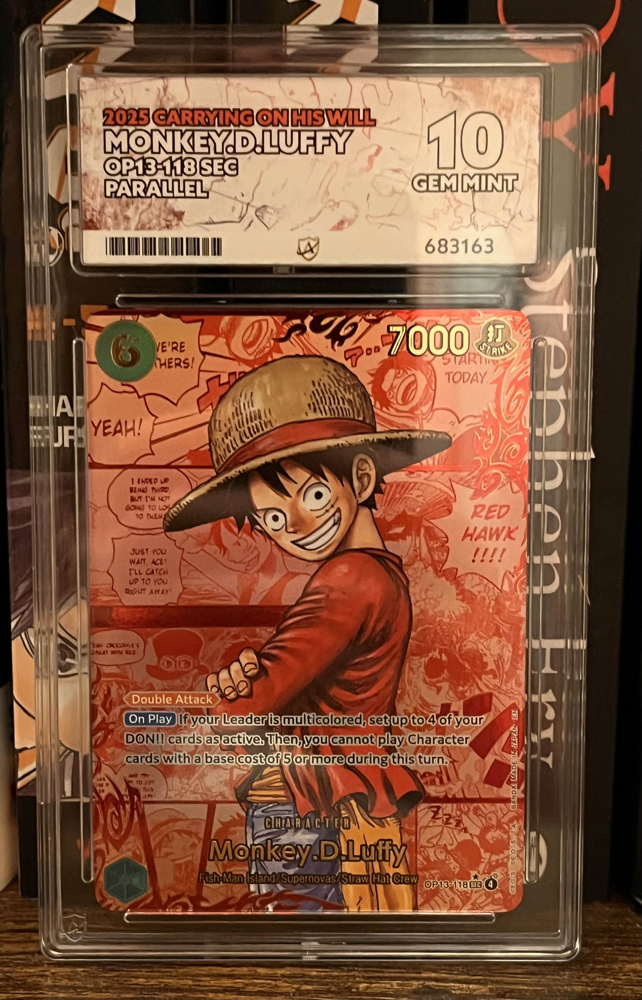
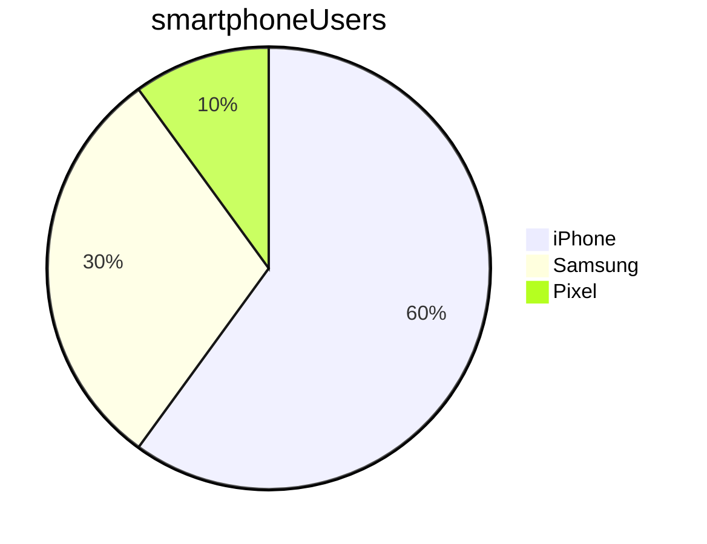

# Markdown Learning

## Heading

### A single hash heading

* Use a single hash for biggest heading

<br>

## Lists

### Bulleted lists (unordered)

* list item 1
* list item 2

### Numbered Lists

1. first step
2. second step

### Mixed Lists

* List item 1
    1. Do this
    
       Note:
       2. note 1
       3. note 2
    2. then this
* List item 2

## Bold and Italics

I want to bold the word **cat**

I want to italicize the word *cat*

I want to bold and italicize ***cat***

## Quotes

> D'oh
>> Homer Simpson

## Images and Links

Here is an embedded image:


Here is a link to the image:
[luffy.jpg](../images/luffy.jpg)

## Formatting code and commands

This is some Python code:  `print('hello')`

This is some Python code:
```python
print("hello")
```

## Task list

- [ ] This is a list item
- [x] this is a finished item

## Table:

Name    |   Street   |  Town
--------|------------|----------
Cathy   | Main St    | Birmingham
John    | Maple Drive  | Stafford

## Mermaid

Example of a visualization:

